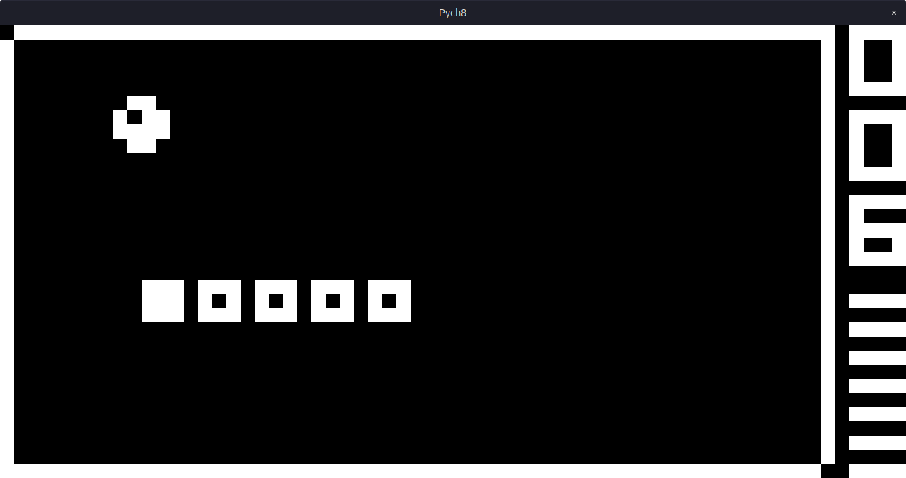

# Pych8
This is a simple Chip-8 interpreter written in Python3.



## Usage
Make sure install to numpy and pygame:  
`sudo pip install numpy`  
`sudo pip install pygame`


Running: `python main.py [-h] rom.ch8`

Controls: 
```
- Enter - Reload rom
- Default keybinds: 
        Chip-8            Keyboard
    1   2   3   C       6   7   8   9
    4   5   6   D  -->  y   u   i   o
    7   8   9   E       h   j   k   l
    A   0   B   F       n   m   ,   .
```


Settings (in settings.py):  
`SCALE` - By how much to scale the display (64x32 px).  
`STEP_PERIOD` - Inverse of de CPU Clock frequency.  
`CLOCK_PERIOD` - Inverse of the Timer Clock frequency.  
`KEYS` - Keybinds.  
`SAMPLERATE` - Sample rate of the beeps  
`sound_wave` - The wave defining the beep, currently a 440Hz sign wave.

## Resources used

[Wikipedia](https://en.wikipedia.org/wiki/CHIP-8)

[ Cowgod's Chip-8 Technical Reference v1.0](http://devernay.free.fr/hacks/chip8/C8TECH10.HTM)

